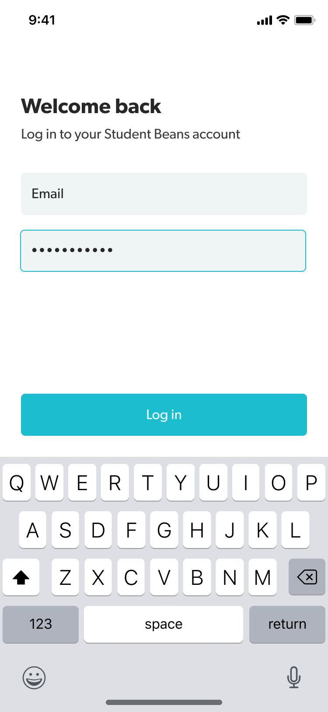
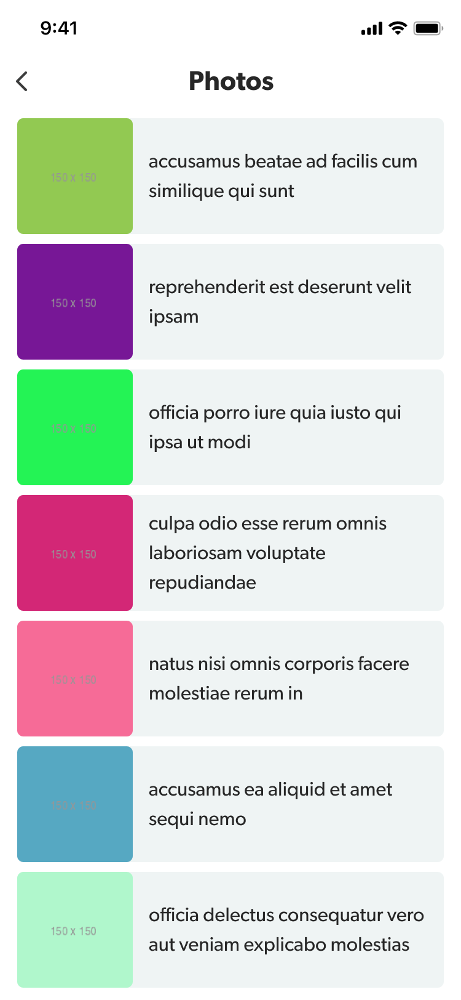

# Student Beans Android Task

Homework exercise for candidates.

## Instructions

Complete this app recreating the designs below, and focus on the following:

 - Preferred Language: Kotlin.
 - Focus on best practices.
 - You can use any architecture pattern but MVVM is preferred.
 - Extra points for the usage ofthe latest androidx and jetpack libraries.
 - Extra points for unit tests.
 
 # The screens
 - Login: On tapping "Log in", validate the fields aren't empty and show the Photos screen
 - Photos: On the Photos screen, show a list of images from this API: https://jsonplaceholder.typicode.com/photos (show the image from `thumbnailUrl` and the `title`)

 Show us your best code!

## Designs

 
